# House Price Prediction: Agentic Intelligence System


An advanced real estate advisory platform utilizing a multi-agent orchestration framework to synthesize machine learning valuations with real-time market research.

---

## System Architecture

```mermaid
graph TD
    User([User / Browser]) --> Input[Property metadata input]
    
    subgraph Frontend [Streamlit Frontend]
        Advisory[advisory_app.py<br/>Main copilot UI]
        Entry[streamlit_app.py<br/>Cloud entrypoint]
        Baseline[app.py<br/>Baseline app]
    end
    Input --> Frontend

    subgraph Orchestration [LangGraph Agent Orchestration]
        Predict[Prediction Agent<br/>ML price inference]
        Advise[Advisory Agent<br/>Investment scoring]
        Search[Search Agent<br/>Web + market lookup]
    end
    Frontend --> Orchestration

    subgraph Core [Core Logic & Models]
        RF[Random Forest<br/>200 trees, R²=0.88<br/>model.pkl]
        RAG[RAG Pipeline<br/>Markdown KB search]
        LLM[LLM Providers<br/>Groq / Google Gemini]
    end
    Orchestration --> Core

    subgraph Data [Data & Configuration]
        CSV[kc_house_data.csv<br/>21,613 historical sales]
        FE[Feature Engineering<br/>Age, Amenity Score]
        Config[Config Layer<br/>Secrets, API keys]
    end
    Core --> Data

    subgraph Output [Output Layer]
        Dash[Analytics Dashboard<br/>Plotly charts, comps]
        Price[Price Prediction<br/>Range, confidence score]
        PDF[PDF Advisory Report<br/>ReportLab, exec summary]
    end
    Data --> Output

    Output --> Deploy([Streamlit Community Cloud])
```



---

## Agentic AI Orchestration

The system utilizes a directed acyclic graph (DAG) managed by **LangGraph** to coordinate specialized agents. This architecture ensures stateful execution and precise tool-calling.

### Agent Node Specifications
| Agent | Primary Responsibility | Integrated Tools |
| :--- | :--- | :--- |
| **Prediction Agent** | Factual grounding and ML inference | Random Forest Model, Scikit-Learn |
| **Search Agent** | Real-time market data retrieval | DuckDuckGo Search API |
| **Advisory Agent** | Investment risk and strategy synthesis | RAG Pipeline, Client Objective Matrix |

### Execution Workflow
1. **Planning Phase**: The system initializes the state and determines the search parameters based on the property's location and features.
2. **Analysis Phase**: The Prediction and Search agents execute in parallel. The ML agent provides a baseline price from historical data, while the Search agent fetches current neighborhood sentiment.
3. **Synthesis Phase**: The Advisory agent reviews the outputs, identifies risks (e.g., condition/location mismatches), and generates a final strategic report.

---

## Machine Learning Methodology

### Model Architecture
- **Type**: Random Forest Regressor (Ensemble Learning)
- **Estimators**: 200 Decision Trees
- **Performance Meteric**: R² score of 0.88 on King County validation set
- **Output**: Range-based prediction with confidence intervals

### Featured Engineering
The following derived features significantly impact model performance:
- **House Age**: Computed as `Current Year - Year Built`
- **Renovation Status**: Boolean indicator for properties updated after 2010
- **Amenity Score**: Weighted aggregation of Waterfront, View, Condition, and Grade metrics

---

## Core Functionality

### 1. Decision Copilot
*   **Predictive Valuation**: Precise price estimation grounded in local historical sales.
*   **Market Contextualization**: Real-time correlation of listing data with live market trends.
*   **Negotiation Strategy**: Algorithmic determination of anchor and walk-away pricing.

### 2. Scenario Laboratory
*   **Sensitivity Analysis**: Dynamic modeling of price impact based on structural modifications.
*   **ROI Verification**: Real-time appraisal of renovation value-add.

### 3. Property Intelligence Chatbot
*   **Contextual Awareness**: Conversational interface with memory of current property analysis.
*   **Geospatial Logic**: Capability to analyze properties across 50+ US metropolitan areas.

---

## Installation and Configuration

### Environment Setup
1. **Repository Synchronization**:
   ```bash
   git clone https://github.com/PriyanshuCP42/house-price-prediction_agentic_ai.git
   ```
2. **Dependency Management**:
   ```bash
   pip install -r requirements.txt
   ```
3. **Security Configuration**:
   Populate `.streamlit/secrets.toml` with the following:
   ```toml
   GROQ_API_KEY = "your_key"
   MAPBOX_API_KEY = "your_key"
   ```

### Execution
```bash
streamlit run streamlit_app.py
```

---

**Technical Specification Document**
**Maintained by**: [PriyanshuCP42](https://github.com/PriyanshuCP42)
